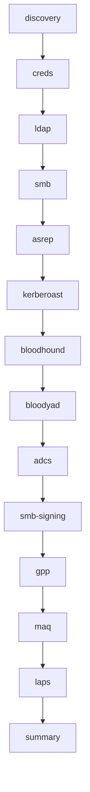

# ADE — Automated Active Directory Enumeration

> **Version:** 1.2.0  
> **Author:** Blue Pho3nix  
> **Repo:** [github.com/trewwwsec/ade](https://github.com/trewwwsec/ade)  
> **Python:** ≥ 3.10

ADE is a Python CLI that automates AD reconnaissance in lab environments — Hack The Box, Hack Smarter, TryHackMe, Proving Grounds, OSCP, and CPTS.

---

## Quick Start

```bash
ade -r 10.10.10.161                    # anonymous
ade -r 10.10.10.161 -u user -p pass     # authenticated
ade -r 10.10.10.161 -u user -p pass -d CORP.LOCAL -f dc01.corp.local  # full context
```

See [[Installation]] for setup, [[CLI Reference]] for all flags.

---

## Navigation

### Getting Started
- [[Installation]] — pip, pipx, uv, and the helper installer
- [[Dependencies]] — nmap, nxc, Certipy, Impacket, BloodHound, bloodyAD
- [[CLI Reference]] — all flags, `--modules`, `--skip`, `-v`, `-o`

### Module Reference
- [[Modules]] — overview, prerequisites, execution order
- [[discovery]] — domain/FQDN discovery via anonymous LDAP
- [[creds]] — credential validation and Kerberos detection
- [[ldap]] — user enumeration, description extraction
- [[smb]] — share enumeration, RID brute-force, Kerberos ticket management
- [[asrep]] — AS-REP roasting, user:user spraying, no-auth SPN requests
- [[kerberoast]] — Kerberoasting, TGS hash extraction, auto Kerberos rerun
- [[bloodhound]] — BloodHound CE data collection
- [[bloodyad]] — writable object permission checks
- [[adcs]] — ADCS enumeration via Certipy
- [[smb-signing]] — SMB signing requirement check
- [[gpp]] — GPP/cpassword credential recovery
- [[maq]] — MachineAccountQuota check for RBCD viability
- [[laps]] — LAPS password readability check
- [[summary]] — findings summary and exam report generator

### Workflows
- [[Workflows#Anonymous|Anonymous Enumeration]] — no-credential recon
- [[Workflows#Authenticated|Authenticated Enumeration]] — full scan with credentials
- [[Workflows#Kerberos|Kerberos Mode]] — auto-detected Kerberos-only environments
- [[Workflows#CPTS-Exam|CPTS Exam Workflow]] — time-optimized exam strategy
- [[Workflows#Targeted|Targeted Module Runs]] — `--modules` / `--skip`

### Output & Artifacts
- [[Output Artifacts]] — what gets created and where
- [[ade_summary.txt]] — exam-ready findings report

### Exam Guides
- [[CPTS Exam Guide]] — quick reference for CPTS exam day
- [[Attack Paths]] — common escalation routes from ADE findings

---

## Module Execution Order



## All Modules

| # | Module | Auth Required | Prerequisites |
|---|--------|:---:|---|
| 1 | [[discovery]] | ❌ | none |
| 2 | [[creds]] | ✅ | username, password |
| 3 | [[ldap]] | ❌ | none (works anonymous) |
| 4 | [[smb]] | ❌ | none (works anonymous) |
| 5 | [[asrep]] | ❌ | domain |
| 6 | [[kerberoast]] | ✅ | domain, fqdn, credentials |
| 7 | [[bloodhound]] | ✅ | domain, fqdn, credentials |
| 8 | [[bloodyad]] | ✅ | domain, fqdn, credentials |
| 9 | [[adcs]] | ✅ | domain, fqdn, credentials |
| 10 | [[smb-signing]] | ❌ | none |
| 11 | [[gpp]] | ❌ | none |
| 12 | [[maq]] | ✅ | domain, credentials |
| 13 | [[laps]] | ✅ | domain, credentials |
| 14 | [[summary]] | ❌ | none (runs last) |

---

## Key Design Decisions

- **Lazy output dir** — resolved at startup, created on first artifact write
- **Auto Kerberos switching** — detects NTLM failure, restarts with `-k`
- **Intelligent retries** — SMB/nxc commands retry on empty or invalid output
- **Exact `--modules`** — no implicit dependency injection; prerequisites checked explicitly
- **Runtime state isolation** — repeated `main()` calls don't leak state
- **argv-based subprocess** — shell-safe command construction
- **Bounded subprocess timeouts** — impacket/certipy/BloodHound calls can't hang a run indefinitely
- **Optional host wait/retry** — `--wait-host` polls a still-booting lab instead of exiting immediately
- **Data-driven summary** — findings summary reflects actual signing/MAQ/policy/GPP/LAPS results, not generic advice
