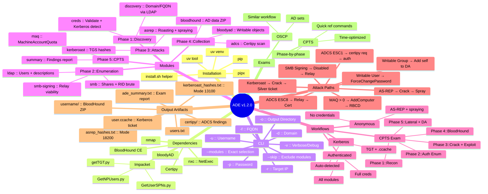

# ADE Mindmap

---

## Full Wikilink Index

### Hub
- [[ADE]]

### Setup
- [[Installation]]
- [[Dependencies]]

### Reference
- [[CLI Reference]]
- [[Modules]]
- [[Output Artifacts]]

### Modules (1-12)
- [[discovery]]
- [[creds]]
- [[ldap]]
- [[smb]]
- [[asrep]]
- [[kerberoast]]
- [[bloodhound]]
- [[bloodyad]]
- [[adcs]]
- [[smb-signing]]
- [[maq]]
- [[summary]]

### Artifacts
- [[users.txt]]
- [[asrep_hashes.txt]]
- [[kerberoast_hashes.txt]]
- [[ade_summary.txt]]

### Guides
- [[Workflows]]
- [[Attack Paths]]
- [[CPTS Exam Guide]]

### Meta
- [[Mindmap]] _(this note)_

---

## Graph View

For the best Obsidian graph experience:

1. Open the graph view
2. Filter to `path:docs/`
3. Group by `tags` or folder
4. The central nodes will be: [[ADE]], [[Modules]], [[Workflows]], [[Attack Paths]], [[CPTS Exam Guide]]

## Related

- [[ADE]] — start here
